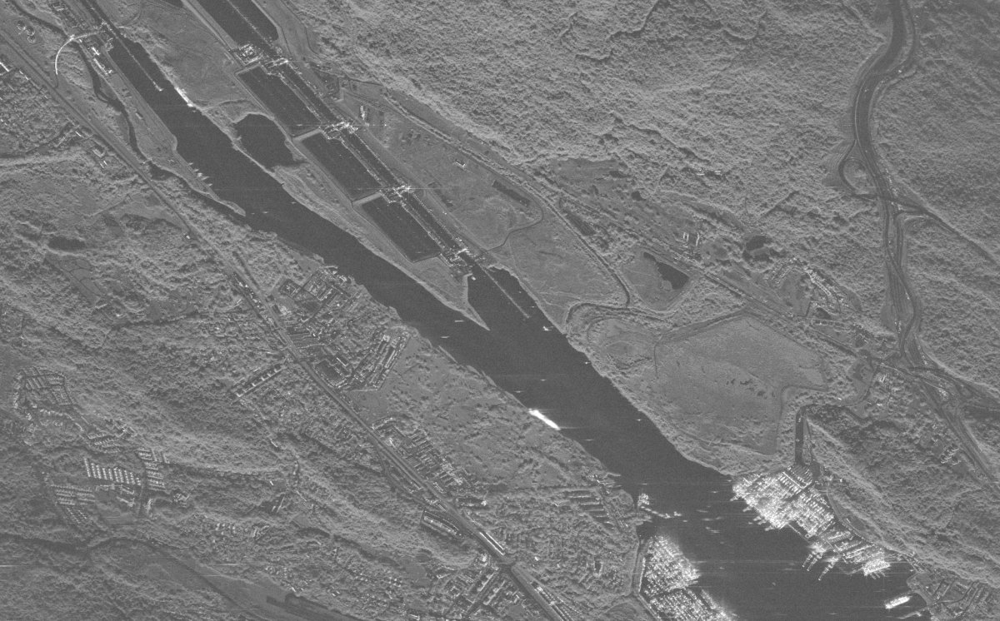

# FastSAR

[](LICENSE)
[](pyproject.toml)

FastSAR forms synthetic aperture radar (SAR) images on x86 CPUs, Nvidia GPUs and Google Cloud TPUs from Python. It
reads frequency-domain CPHD files, forms spotlight, stripmap and sliding spotlight images by factorized
backprojection, and makes products: autofocus, interferometry, geolocation, map GeoTIFFs and SICD.



*Panama Canal, Pacific entrance (Umbra open data, 2023-07-18): 12,207 by 8,808 pixels in 4.3 s on an Nvidia L4
(warm former, transfers included; float32, -59.5 dB against float64 exact backprojection), downsampled. A
c4d-highmem-16 CPU instance (16 vCPUs, 8 cores) takes 12.4 s. ISCE3, the fastest open-source code that forms this
collection, would take an estimated 4.8 h on that CPU and 27 min on the L4.*


*Cost per 1000 Panama images (October 2026 prices) against error over the lock, port and ship regions, relative to
the float64 image ([performance](docs/performance.md), [comparison](docs/comparison.md)).*

## Install

```bash
pip install "fastsar[io] @ git+https://github.com/saulpingerman/FastSAR"        # io: sarpy for CPHD and SICD
pip install "fastsar[cuda,io] @ git+https://github.com/saulpingerman/FastSAR"   # cuda: CuPy
```

From a clone: `pip install -e ".[cuda,io]"` or `uv sync`. The CPU kernels need `g++` with OpenMP and compile on
first use; the float16 CUDA kernel needs `nvcc`; TPUs need `jax[tpu]`; GeoTIFFs and DEMs need `rasterio`. On the
CPU set `OMP_NUM_THREADS=<physical cores> OMP_PLACES=cores OMP_PROC_BIND=close`.

## Quickstart

```python
import fastsar
from fastsar import products

out = fastsar.form_cphd('scene_CPHD.cphd')        # mode, grid and window from the file
img = out['image']                                # complex64 [nx, ny] on a ground plane at the scene height
lat, lon, h = products.geolocate(out, 100, 200)   # pixel (100, 200) on the ground
products.write_geotiff('amp.tif', **products.geocode_image(out))   # amplitude on a north-up UTM grid
products.write_sicd('scene.nitf', out)            # complex image with its geometry
```

[`examples/chain.py`](examples/chain.py) runs this chain from the command line (`--simulate` needs no data);
[`form_umbra.py`](examples/form_umbra.py) and [`form_capella_stripmap.py`](examples/form_capella_stripmap.py) form
vendor grids.

## Supported data, modes and devices

| Data | Modes | Status |
|---|---|---|
| Capella CPHD | stripmap, spotlight, sliding spotlight | checked against vendor SICDs; a 2022 dynamic stripmap is correct near the center only |
| Umbra CPHD | spotlight | three open-data collections on the vendor's grid |
| ICEYE CPHD | dwell spotlight | formed (28 GB history); not compared with the vendor image |
| TOA-domain CPHD, raw Level-0 | | not supported |
| Simulated echoes | stripmap, ScanSAR, TOPS, any track | `fastsar.stripmap`, `burst`, `patches` |

| | CPU (`cpu`) | Nvidia GPU (`cuda`) | Cloud TPU (`tpu`) | Any JAX device (`jax`) |
|---|---|---|---|---|
| Factorized backprojection | C++/OpenMP, AVX-512 or AVX2 | CUDA via CuPy | Pallas | reference program |
| Precision | float32 | float32, float16 | three-pass (default), single-pass | float32, float16 |
| Exact backprojection (`ExactFormer`) | C++/OpenMP, float32 with float64 tile centers | CUDA, the same | falls back to `jax` | float32, float64 block centers |

Polar format (`algorithm='pfa'`) runs as a JAX program on any device.

## Documentation

[docs/README.md](docs/README.md) lists every page; start with the [processing chain](docs/processing-chain.md).
Measurement records are in [sar-accel-study](https://github.com/saulpingerman/sar-accel-study). A citation file
will come with the preprint.

## Contributing and license

[CONTRIBUTING.md](CONTRIBUTING.md) explains how to run the tests. MIT license ([LICENSE](LICENSE)).
