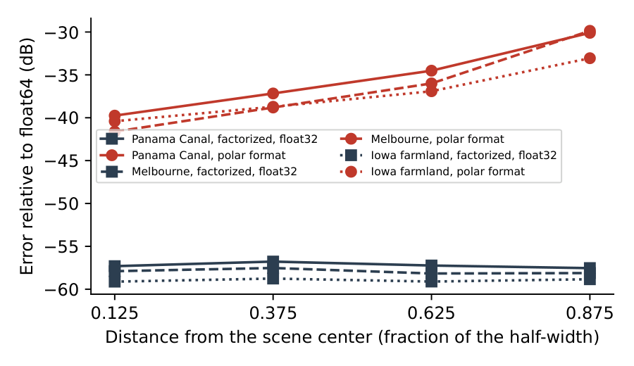

# Spotlight image formation

## Factorized backprojection

`form_image` puts pixel (i, j) at `(i - nx/2) spx e1 + (j - ny/2) spy e2` relative to the scene reference point
and applies a Taylor window (-35 dB, nbar 4) unless `window=False`. It plans and compiles on every call, an
`ImageFormer` once per antenna path; on JAX and TPU, equal plans share one program.

The image is divided recursively into tiles (three levels by default). At each level the phase history of a parent
tile is re-referenced to each child tile's center by a phase ramp, then low-pass filtered and decimated in frequency
and pulse index by a Kaiser-windowed sinc (70 dB design attenuation). At the last level the range to each pixel is
linearized about the tile center, so each final T by T tile is a product of two matrices and a per-pixel quadratic
phase correction. Images may have any shape and size.

The TPU kernels fuse rotation and decimation and run the final stage on the matrix units; the CUDA kernels use
shared-memory filters and, for float16, tensor cores. CUDA and C++ use float64 geometry at every level and agree to
about -87 dB in float32; the JAX program and the TPU kernels compute the last level's geometry in float32.

### Tile size and range

The final stage models each tile with a plane wave plus an aperture-mean curvature term. The residual grows as the
square of the tile size and falls with range. With `T='auto'` FastSAR predicts the error from the geometry, takes
the largest tile (32 or 16) that meets `target_db` (default -40 dB), and warns when neither does
(`ImageFormer.predicted_error_db`). Spaceborne collections keep T=32; CUDA float16 always uses it. Test results
(`tests/test_accuracy.py`, 128 by 128 pixels of 0.5 m): at 1 km, T=16 gives -34.8 dB (T=32: -22.5 dB); at 4 km,
T=16 gives -47.0 dB (T=32: -35.7 dB); at 16 km, T=32 gives -47.7 dB. The prediction is within 1.3 dB of these. At
600 km both tile sizes give about -63 dB, set by errors other than the tile model.

## Exact backprojection

`ExactFormer` forms an exact backprojection on the `form_image` grid. Everything that depends only on the geometry
is computed once: the window, the pixel tiles and their centers, and the range bins each pulse can reach (from the
grid's nearest point to the antenna, by projection onto the plane, to its farthest corner). Each pixel's range is
its tile center's, in float64 once per tile and pulse, plus a third-order expansion in its offset `d` from the
center: with `u` the unit vector from the antenna to the center, `r` their distance, `du = d.u` and
`D2 = |d|^2 - du^2`, `|w + d| - |w| = du + D2 / (2 r) - du D2 / (2 r^2)`; no division or square root is evaluated
per pixel. The next term is at most `h^4 / (8 r^3)` for a tile of half-diagonal `h`. Each former takes the largest
tile (32 by 32 down to 4 by 4 pixels on the CPU, 8 by 8 on CUDA) whose bound `h^4 / (2 r^3)`, with `r` the smallest
pixel-to-antenna distance, stays below 3e-4 rad of phase at the highest frequency, and warns when none does. Orbital
collections keep 32 by 32 tiles; at X band with 1 m pixels, ranges of 1 to 2 km take 8 by 8 tiles. On simulated
128 by 128 pixel scenes (cubic, against a float64 backprojection at 64 times oversampling) the error is -68 dB from
0.5 to 20 km and at 600 km. Range profiles are kept only over the reachable bins and read with cubic
Lagrange interpolation at `upsample=4` (default) or linear interpolation at `upsample=8`. On the Umbra Panama
collection cubic interpolation measures -70.0 dB against the float64 reference (about that reference's own
accuracy), and linear -56.9 dB (`tests/test_exact.py` checks -65 and -52 dB on simulated scenes at 20 and 600 km).
The CUDA and C++ kernels implement this; on TPU, `ExactFormer` runs `backproject`'s JAX program with linear interpolation, at
`upsample=16` in place of cubic at 4 (linear keeps 8).

`backproject` forms the image at any points, such as `plane_points(...)` on a DEM; `rcv` makes it bistatic (`ant` is
then the transmitter) and `ref` handles a moving reference point. Its cost is pulses times points. Each pulse is
range compressed by an FFT zero-padded `upsample` times (default 8) and read with linear interpolation. Ranges are
float64 at the centers of 256-point blocks and float32 within a block, so float32 kernels stay accurate at orbital
range. The CPU kernel works in float64; `backend='tpu'` runs the JAX program.

Test results (`tests/test_bp.py`, `upsample=16`, against float64): CPU -77 to -82 dB, JAX and CUDA -72 to -76 dB,
monostatic and bistatic, at 5 and 600 km; a moving reference point matches a fixed one to -60 dB. Against a 128x
reference at 4 km (`tests/test_accuracy.py`) the error falls by 12 dB per doubling of `upsample`: -38.7 dB at 2,
-62.8 dB at 8, -87.7 dB at 32.

## Polar format

`algorithm='pfa'` resamples the data onto a rectangular wavenumber grid by chirp-z transforms and applies a 2-D FFT.
`pfa_guard` (default 300 m, for orbital scenes) is the margin kept free of wrap-around; small simulated scenes need
less. The planar-wavefront assumption displaces scatterers away from the center: on Panama by up to 18 pixels in
azimuth and 12 in range at the corners. FastSAR removes the displacement predicted from the geometry by a final
resampling. The error is then -32.1 dB on Panama (Melbourne -33.4 dB, Iowa -35.3 dB). It grows by about 10 dB from
the inner to the outer ring around the scene center; the factorized image's error stays level:

*Error relative to the float64 reference in four rings around the scene center, for polar format and the float32
factorized image on the L4.*

## Wide-angle and circular apertures

Factorized backprojection makes no small-angle assumption, so it forms wide-angle and circular collections. Test
results (`tests/test_wide_angle.py`): 256 by 256 images at the resolution of 10, 45, 120 and 360 degree apertures (X
band, 1.5 GHz, pixels of 72 to 6 mm) agree with exact backprojection to -53.1, -62.2, -63.8 and -65.2 dB.

## Autofocus

`autofocus.autofocus` runs phase gradient autofocus (PGA) along azimuth on a factorized backprojection image,
first multiplied by `exp(-1j * deramp_phase(...))` so each pulse falls in one azimuth bin. The brightest pixel of
each range line is centered, the lines with the highest peak-to-mean intensity are windowed, and the phase
difference between adjacent bins is estimated jointly, with a window that narrows as the image focuses. The
estimate is mapped to pulses, the history corrected and the image re-formed, twice by default.

Test results (`tests/test_autofocus.py`, 128 by 128 pixels of 0.5 m, 40 targets over 3,000 clutter scatterers at
5 km; error against the error-free image, residual rms without constant and linear terms):

- quadratic, 5.3 rad peak: -2.7 dB before, -30.1 dB after, residual 0.037 rad
- fifth-order polynomial, 4.1 rad peak: -6.8 dB before, -30.2 dB after, residual 0.036 rad
- low-pass random walk, 3.0 rad peak: -0.2 dB before, -30.3 dB after, residual 0.036 rad

On the error-free image the procedure changes the image by -30.1 dB, a floor set by clutter and by scatterers
sharing a range line. It needs azimuth pixels finer than the resolution and a bin spacing, 1/(nx spx), fine enough
to follow the phase error. It is tested on simulated images only.
