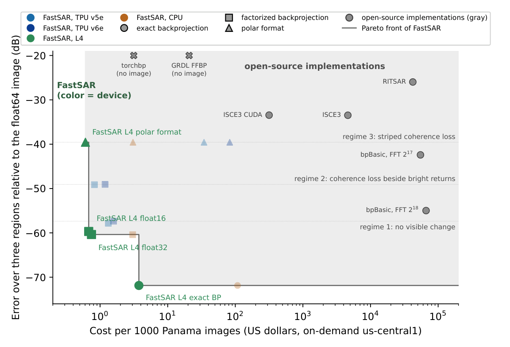
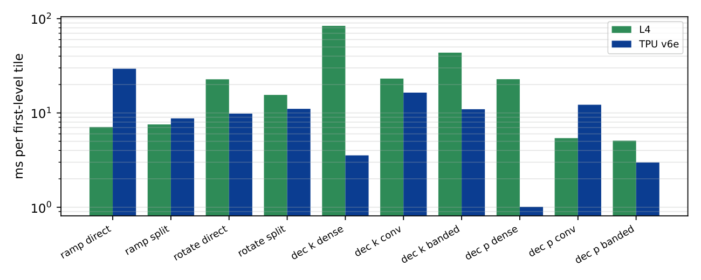

# Performance

## Timing protocol and devices

Times run from the phase history in host memory to the image in host memory, transfers included, with a warm
`ImageFormer` (planned and compiled beforehand). The other pages call this "host to host, warm former".
`form_image` adds a few seconds of planning and compilation. The devices are a TPU v6e and a TPU v5e (one chip
each), an Nvidia L4, and a c4d-highmem-16 CPU instance (AMD EPYC 9B45, 16 vCPUs on 8 cores).

## Time and cost per image

The Umbra Panama image ([real-data.md](real-data.md#umbra-spotlight)) at float32-class accuracy (-57.8 to -60.0 dB,
[precision.md](precision.md)), on-demand us-central1 prices of October 2026:

| Device | Seconds per image | Dollars per 1000 images |
|---|---|---|
| TPU v6e (three-pass) | 3.1 | 1.58 |
| TPU v5e (three-pass) | 5.2 | 1.32 |
| L4 (float32) | 3.8 | 0.75 |
| L4 (float16 storage, float32 accumulation) | 3.5 | 0.68 |
| c4d-highmem-16 | 11.3 | 3.04 |

Cost is the hourly price divided by the throughput of back-to-back images (on the TPUs the next history is staged
while one forms). The v6e forms the image fastest; the L4, whose hourly price is about a quarter of the v6e's, has the lowest cost per image. The same ordering holds on the Melbourne and Iowa collections.



Single-pass on the TPUs takes 2.6 s (v6e) and 3.6 s (v5e) at -46.2 dB, $1.18 and $0.82 per 1000 images. Float16
on the L4 and single-pass on the TPUs lower each device's cost by 9 to 38%. Polar format takes 3.0 s on the L4
($0.61 per 1000) and 11.4 s on the c4d-highmem-16, at -32.1 dB. On the TPUs its resampling steps are gathers on the vector unit and take 103 s (v5e) and 110 s (v6e) per image. The L4 draws 0.07 kWh per 1000 float32 images (mean
`nvidia-smi` power, host excluded). These are the release records of the study (FastSAR 0.1.0 release candidates,
public API only).

## Large collections

Phase histories of tens of gigabytes (28 GB for an ICEYE dwell, 10 GB for a Capella spotlight) are handled as
follows. The CPU and CUDA backends do not copy them; the TPU backend copies the history once per image to pad it.

- CPU: the first level reads a C-contiguous complex64 history in place. A group holds up to 8 first-level children
  within a quarter of the available host memory. When fewer than 4 fit, the first level runs in blocks of 2,048
  pulses instead, which was 19% slower on Panama in development. On a Capella spotlight, groups of 2 and 1 took
  58% and 140% longer than groups of 8.
- CUDA: a host history is windowed and checked on the GPU as its blocks are uploaded, without a full complex copy
  on the device; one whose device planes exceed half the free device memory streams through the first level in
  blocks of 4,096 pulses instead.
- TPU: the history is padded once per image for the first-level kernel. A level's pulse decimation is a dense
  matrix product up to 2^24 matrix entries; above that, the TPU applies the filter in banded blocks. A dense matrix
  for the 74,203-pulse spotlight would take 2.8 GB, and its cost grows as the square of the pulse count.

## Compiled programs

The JAX and TPU backends cache up to 32 compiled programs and their plan arrays by plan signature. Before forming,
a mosaic finds each patch's pulse span and picks a few shared pulse counts, so patches are padded up to a count
that already has a compiled program. `FASTSAR_COMPILE_PATCHES` sets how many patch formations one compilation is
worth: 11 on a TPU, where a program compiles in about 8 s and a dynamic stripmap patch forms in 0.7 s, and 3 on
JAX. Range gates are planned the same way, and gates and pulse counts outside the plan are widened by up to
`FASTSAR_PULSE_SLACK` (0.04). The 78-patch 2022 Capella dynamic stripmap mosaic compiles one program instead of 38.
Each patch's history is checked, scaled and uploaded on a worker thread (`ImageFormer.stage`). Without the program
cache, the 2021 Capella stripmap mosaic on a v6e spent 19 s of 52 s rebuilding plan arrays.

In a mosaic the range profiles are computed once and stay in GPU memory on `cuda` when they fit, with the range gate
on the GPU. While one patch forms, worker threads prepare the next ones. The CPU uses one thread, since its
formation already uses every core; a GPU or TPU uses up to four, which would otherwise wait about 0.5 s per patch
for host preparation. On a 2 by 4 patch Capella sub-mosaic on the c4d-highmem-16, one prefetch thread cuts the
time per patch from 1.08 s to 0.91 s.

## Memory

When device or host memory is short, a former takes a slower path and issues a `fastsar.MemoryWarning`.
`former.memory()` reports the requirement in advance, in about 15 µs.

At full speed the phase history stays on the device and the first level runs in groups of 8 children (4 on a TPU).
On a v6e, groups of 4 and 8 formed the 2025 Capella spotlight equally fast, and groups of 2 took 1% longer. On the
L4 the same spotlight took 17.9 s in groups of 8 in development. It took 2% longer in groups of 4 and 44% longer
with the history streamed from host memory. Full speed for it needs 23.3 GB, just above the 22.9 GB free on the L4,
so the release forms it in groups of 4 (17.9 s); the 74,203-pulse 2024 spotlight needs 33.8 GB and runs in groups
of 2. The number of first-level children carried together through the later levels (up to half the free
memory) does not affect speed. Batches of 1, 2 and 4 formed that spotlight within 1% of each other, and a smaller batch is not reported as a fallback.

The fallbacks are smaller groups or pulse blocks on the CPU, smaller groups on GPU and TPU, and streaming of the
history through the first level on CUDA. A CUDA mosaic keeps a GPU window of the range profiles and cuts the gates in
host memory when a patch's profiles exceed it. Each fallback issues a `MemoryWarning` naming it; warnings issued before formation also give the bytes full speed needs and the bytes free. A size set by
`FASTSAR_CPU_GROUP_GB`, `FASTSAR_CUDA_GROUP`, `FASTSAR_TPU_GROUP` or an explicit `ng` issues none. A TPU that cannot
hold the history and one first-level child raises `MemoryError` with the memory those two need.

```python
import warnings
former = fastsar.ImageFormer(...)
former.memory()     # bytes: {'backend': 'cuda', 'needed': ..., 'available': ..., 'full_speed': True, 'parts': {...}}
warnings.simplefilter('ignore', fastsar.MemoryWarning)   # silence the fallback warnings
```

## Environment variables

| Variable | Default | Effect |
|---|---|---|
| `CXX` | `g++` | CPU kernel compiler |
| `FASTSAR_CACHE_DIR` | `$XDG_CACHE_HOME/fastsar`, else `~/.cache/fastsar` | where compiled CPU kernels are cached (one shared object per source, compiler, flags and CPU) |
| `XLA_PYTHON_CLIENT_PREALLOCATE` | set to `false` by `import fastsar` unless already set | JAX otherwise reserves 75% of a GPU's memory on first use, which the CUDA kernels and JAX programs then could not share; set it before the import to keep JAX's default |
| `FFBP_CPU_FLAGS` | `-O3 -march=native -mprefer-vector-width=512 -funroll-loops` (`backproject` and `ExactFormer`: `-O3 -march=native`) | compiler flags; `ExactFormer` always adds `-ffast-math` (its sines and cosines vectorize only with it), at compile time only: the shared objects are linked without it, so loading them leaves the process's floating-point mode alone. Builds are cached per source, compiler, flags and CPU |
| `FASTSAR_CPU_GROUP_GB` | a quarter of available memory | CPU first-level group budget (GB) |
| `FASTSAR_CUDA_GROUP` | from free memory: 8 at full speed | CUDA first-level children per group |
| `FASTSAR_TPU_GROUP` | from the device's memory: 4 at full speed | TPU first-level children per group |
| `FASTSAR_CUDA_STREAM` | above 50% of free GPU memory | `1` always streams |
| `FASTSAR_SHARED_PROFILES` | `1` | `0` re-transforms the history per mosaic patch |
| `FASTSAR_WEIGHT_TERMS` | `0` | `1` applies the mosaic window as SVD terms |
| `FASTSAR_WEIGHT_GRAD` | `1` | `0` drops the weight's variation across a final tile |
| `FASTSAR_MOSAIC_PREFETCH` | `1` (CPU), `4` (GPU, TPU; at most a quarter of the CPU's threads) | worker threads preparing the next patches; `0` prepares them one at a time |
| `FASTSAR_COMPILE_PATCHES` | `11` (TPU), `3` (JAX) | patch formations one compilation is worth, for the pulse counts a mosaic compiles |
| `FASTSAR_PULSE_SLACK` | `0.04` | relative widening of mosaic range gates and pulse counts so patches share compiled programs |
| `FASTSAR_TIMING` | off | `1` times mosaic steps; `patches.report_timing()` returns them |

Numeric settings out of range raise `ValueError`. The `FFBP_` prefix is a legacy name. `FASTSAR_CPU_BLOCKED` (`1`
forces the CPU's pulse blocks, `0` forbids them), `FASTSAR_PROFILE_WINDOW_ROWS`, `FASTSAR_FIRP_GLOBAL`,
`FFBP_FORCE_TPU_KERNELS` and `FASTSAR_TEST_MAX_GB` (the default of the tests' `--max-rss-gb` option) exist for the
tests only.

## Kernel times and stage profile

On the c4d-highmem-16 the float32 Panama image takes 224 s as a single JAX program (`backend='jax'`) and 11.3 s
with the C++ kernels. On the accelerators, in development and on the device, the JAX program took 4.6, 9.3 and
13.7 s (v6e, v5e, L4) and the kernels 2.4, 4.6 and 3.5 s. In the profiled builds every kernel stage ran within 1.0
to 2.5 times a lower bound set by its limiting hardware unit, measured by microbenchmarks on the same device.



*Time per first-level tile of each stage (phase ramps, rotation, decimation in range and in pulses) by form, on the
v6e (single-pass) and the L4 (float32 data, TF32 tensor-core matrix products), in the JAX program.*

Run scripts and records: [sar-accel-study](https://github.com/saulpingerman/sar-accel-study).

## Exact backprojection

`ExactFormer` on the Umbra Panama collection (12,207 by 8,808 pixels, 15,186 pulses), host memory to host memory,
warm former, against the float64 reference:

| Device | Cubic, `upsample=8` (default) | Linear, `upsample=8` |
|---|---|---|
| L4 (g2-standard-4) | 24.1 s, -67.4 dB | 20.3 s, -56.9 dB |
| c4d-highmem-16 | 433 s, -67.4 dB | 292 s, -56.9 dB |

The cubic error is the reference's own: against a float64 backprojection oversampled 64 times, the reference is
-67.3 to -68.8 dB on the lock, port and ship regions and the cubic image -77.5 to -81.7 dB (the float32 factorized
images -57 to -63 dB). Cubic at 4 times, the default before 0.1.1, reaches -59.8 to -69.6 dB against that truth. The CUDA kernel runs at about 68
billion pixel-pulse pairs per second on the L4 (cubic, 24.1 s); in development it ran at 86% of the L1 cache's throughput for its
data-dependent reads (Nsight Compute), and staging the profiles in shared memory or reading sample
pairs as 16-byte words did not make it faster. The C++ kernel runs at about 4 billion per second on the
c4d-highmem-16, limited by its vector gathers.

Exact backprojection costs pulses times pixels, factorized backprojection about pixels times the logarithm of the
pulse count plus a fixed cost of reading the history. On square grids at the center of the Panama scene (all 15,186
pulses, warm formers) on an L4 (g2-standard-4), exact backprojection with cubic interpolation at 8 times took 0.78, 1.29, 3.85
and 14.9 s at 1024, 2048, 4096 and 8192 pixels on a side, against 1.00, 0.96, 1.42 and 2.63 s for `ImageFormer`:
the two meet between 1024 and 2048 pixels on a side. On the c4d-highmem-16 factorized backprojection was faster at every size (7.5 against
2.6 s at 1024 pixels, 269 against 7.2 s at 8192). On the three Panama regions exact backprojection is 19 to 21 dB more
accurate against the 64 times truth. Records: `results/fastsar/crossover` in sar-accel-study.
