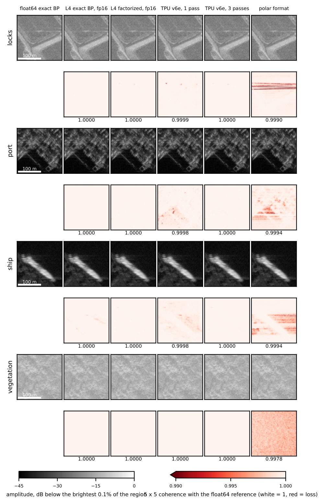
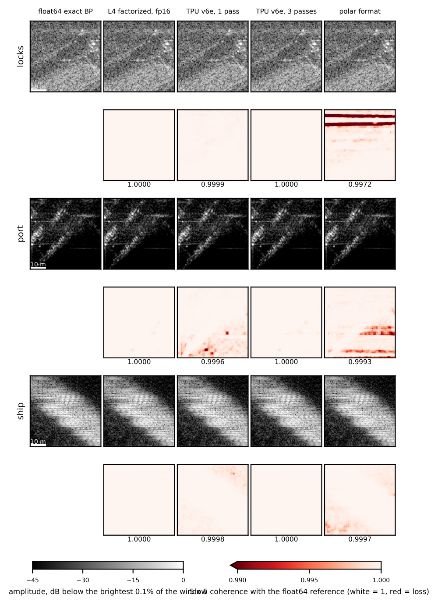

# Precision and image quality

## Precision options

`precision=` takes `'float32'` (default; on a TPU, three bfloat16 passes per product), `'float16'` (CUDA: float16
history and intermediates, float32 accumulation, tensor-core final stage, `T=32`; on `jax`, float16 throughout), or
`'single-pass'` and `'three-pass'` (the TPU's bfloat16 products). Single-pass is what the TPU's matrix unit does
without FastSAR's correction passes; FastSAR's TPU default is three-pass. Geometry is evaluated in float64
on the host; only offsets within tiles use reduced precision.

## Measured on the Umbra Panama collection

Errors are relative to a float64 exact backprojection (16 times oversampled), after one fitted gain, as the energy
of the difference over the whole image.

| Configuration | Error (dB) |
|---|---|
| CPU, float32 | -59.6 |
| Nvidia L4, float32 | -59.5 |
| Nvidia L4, float16 | -58.6 |
| TPU v5e, three-pass | -57.6 |
| TPU v6e, three-pass | -57.5 |
| TPU v5e and v6e, single-pass | -45.8 |
| Polar format with the displacement correction (all devices) | -32.1 |

- Float32-class images (float32 on CPU and L4, three-pass on TPU) leave the amplitude visually unchanged; their 5
  by 5 coherence with the reference exceeds 0.999 even at its 0.1 percentile. The L4 and CPU images are within
  0.1 dB of a float64 factorized image. The TPU kernels compute the last level's geometry in float32, the probable
  cause of their 2 dB larger error.
- Single-pass TPU products add 12 dB. The amplitude is unchanged, but the phase deviates by up to 86 degrees beside
  bright returns (99th percentile 1.0 degree). Use three-pass for interferometry.
- Polar format shows striped coherence below 0.99; its residual grows from -40 dB at the scene center to -30 dB in
  the outer quarter ([algorithms.md](algorithms.md#polar-format)).
- Exact backprojection at the default eightfold oversampling is 0.8 to 4.9 dB farther from the reference than the
  float32 factorized image on the three regions below; range interpolation sets its error.

On Melbourne and Iowa the factorized configurations are within 1.4 dB of the Panama values.

*Four 512 by 512 pixel regions (100 m bar): the Cocolí Locks, the Port of Balboa, a ship in the channel and
vegetated terrain 2.7 km from the center. Top: amplitude over 45 dB. Bottom: 5 by 5 coherence with the reference
from 0.99 (red) to 1 (white), mean below each panel.*

*Pixel scale: 128 by 128 pixel windows (53 m in azimuth by 46 m in slant range, pixels of 0.41 by 0.36 m) around
the brightest feature of the lock, port and ship regions, without interpolation.*
