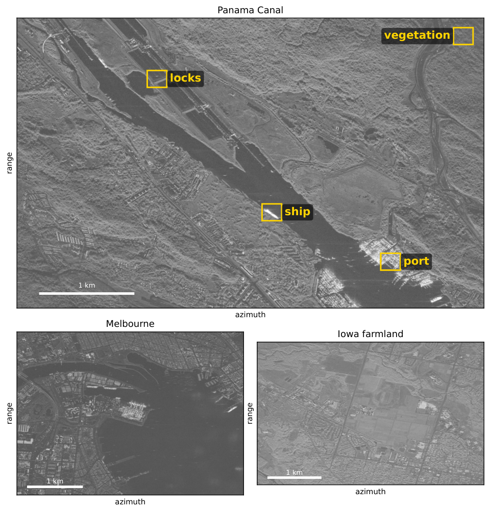
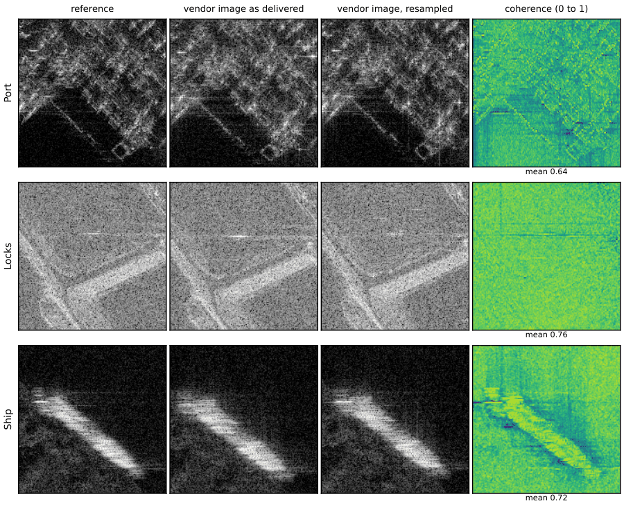

# Real data: CPHD, SICD and vendor collections

FastSAR reads frequency-domain CPHD files through sarpy (`pip install "fastsar[io]"`). This page covers what the
reader does, the collections it has been run on, and the vendor conventions it handles.

## Reading CPHD

```python
col = fastsar.io.read_cphd(path, sicd=None, channel=0, meta=False, troposphere=False, phase_sign=None)
col, meta = fastsar.io.read_cphd(path, sicd=sicd_path, meta=True)
```

`read_cphd` returns the arguments of `form_image` as a dict (`S, ant, fmin, df`, plus `nx, ny, spx, spy, e1, e2`
when a SICD is given). With `meta=True` it also returns the transmitter and receiver positions, the per-pulse
reference ranges, the frame, the polarization and a list of `notes` that says what was done to the data.
`io.local_to_ecf`, `io.ecf_to_local`, `io.ecf_to_geodetic` and `io.geodetic_to_ecf` convert points. It handles:

- per-pulse frequency grids (FXFixed false), resampled onto a common grid with a 16-tap Kaiser sinc (-80 dB on a
  test signal); on the Umbra Panama collection the largest offset is 0.0045 samples and the image changes by -65
  to -94 dB
- a moving scene reference point, re-referenced to the mid-aperture point when the range change is small and
  otherwise left for `backproject` with `ref=meta['ref']`
- channels by index, identifier or polarization (`channel='VV'`)
- pulses with invalid positions (trimmed at the ends, interpolated inside) and empty or flagged pulses (reported)
- with a vendor SICD, the vendor's grid: the origin moves onto its pixel grid so that the image is the SICD array
  (transposed when range runs along rows)
- optionally (`troposphere=True`) the per-pulse troposphere delay at the scene reference point
- a warning when the valid delay window (TOA1 to TOA2) exceeds the unambiguous range c/(2 df)

Time-of-arrival (TOA) CPHD files are not supported. For a SICD whose grid is not a plane (for example a range /
zero-Doppler grid), read without `sicd` and form the vendor's pixels with exact backprojection:

```python
col, meta = fastsar.io.read_cphd(cphd_path, meta=True)
pts = fastsar.io.sicd_points(sicd_path, rows, cols, meta)        # vendor pixels in read_cphd's local frame
img = fastsar.backproject(col['S'], col['ant'], col['fmin'], col['df'], pts, ref=meta['ref'])
```

## Any collection mode in one call

```python
out = fastsar.form_cphd(path, sicd=None, mode='auto', backend='auto', spacing=None, extent=None, height=None)
```

`form_cphd` tells a spotlight (one scene reference point for all pulses) from stripmap, sliding spotlight and
dynamic stripmap collections (one that moves by more than a range resolution), applies a Taylor window,
and forms the image on a ground-plane grid along and across track. The grid covers the SICD footprint when a SICD is
given, else the CPHD image area, and lies at the height of the scene reference point (the SICD's scene center point,
else the CPHD's image area reference point; `height=` overrides it). A spotlight is formed as one image by
factorized backprojection; a moving beam as a mosaic of range-gated patches, each pixel weighted by a Hann window
over the azimuth band around its beam center (the SICD's processed band, else 0.8 of the band the PRF samples),
applied in the final stage of each patch's factorized backprojection
([stripmap-burst.md](stripmap-burst.md#long-apertures-and-arbitrary-tracks)). The SICD is optional. The result
carries the image, its origin, axes and spacing in `read_cphd`'s local frame, the mode, and the reader's notes. `autofocus=True` runs phase gradient autofocus on a spotlight (two rounds, three
image formations). The products in [products.md](products.md) take the result directly: latitude and longitude of
pixels, map GeoTIFFs and SICD.

Checks against the vendors' SICD images, on 600 m grids around the scene center (correlation over 256 by 256 vendor
pixels, with the vendor pixels projected to the grid's height):

| Collection | Mode | SICD given | Amplitude correlation | Intensity correlation, 5 by 5 average |
|---|---|---|---|---|
| Capella, 2021-11-12 | stripmap | no | 0.921 | 0.979 |
| Capella, 2021-11-12 | stripmap | yes | 0.891 | 0.973 |
| Umbra, Panama Canal | spotlight | no | 0.621 | 0.897 |
| Capella, mountains | spotlight | no | 0.440 | 0.868 |
| Capella, mountains | spotlight | yes | 0.605 | 0.904 |
| Capella | sliding spotlight | yes | 0.224 | 0.752 |

Amplitude correlation pixel by pixel is limited by speckle wherever the two processors' windows or azimuth bands
differ; the averaged intensity measures whether the same structure appears in the same place. The sliding spotlight
is the collection of the section below: correct near the scene center only.

## Umbra spotlight

Three Umbra open-data spotlight collections were formed from the CPHD as delivered, on the vendor's own grid.

| Scene | Image (az by rg) | Pulses by samples | Bandwidth | Range |
|---|---|---|---|---|
| Panama Canal, 2023-07-18 | 12,207 by 8,808 | 15,186 by 14,399 | 337 MHz | 738 km |
| Melbourne, 2023-02-08 | 10,077 by 10,273 | 15,948 by 14,399 | 405 MHz | 760 km |
| Iowa farmland, 2023-10-20 | 8,521 by 8,465 | 13,003 by 11,663 | 356 MHz | 653 km |



*The three collections as formed by the float64 exact backprojection, downsampled (amplitude over 45 dB, azimuth
horizontal, range vertical, 1 km bar). The boxes are the regions of [precision.md](precision.md).*

On Panama, FastSAR's pixels coincide with the vendor's to a quarter pixel near the scene center. The vendor forms its
SICD by polar format without correcting the planar-wavefront displacement, so its image is displaced from FastSAR's by
up to 13.2 pixels in azimuth and 9.0 in range on Panama, against 13.2 and 9.1 predicted from the collection
geometry alone. After resampling the vendor image through that model, the residual displacement is at most
0.25 pixel rms on all three collections.



*Port, lock and ship regions (512 by 512 pixels). Columns: the reference, the vendor image as delivered, the
vendor image resampled through the displacement model, and their 5 by 5 coherence (0 to 1). Coherence at this
level reflects differences between the two processors (aperture weighting, motion compensation) and is not a
measure of precision.*

### Geolocation

A 2048 by 2048 crop of Panama, formed by factorized backprojection and geocoded onto the pixel grid of the
vendor's GEC GeoTIFF, and exact backprojection directly onto the same ground points, both land 6.98 m from the GEC
when the surface is taken at the height of the scene reference point (-0.34 m above the ellipsoid). The offset
changes by 1.33 m per meter of assumed height and vanishes at 5.3 m above that height, where exact
backprojection onto the ground points also focuses best (correlation with the GEC 0.75, against 0.13 at -0.34 m).
The vendor's SICD projected through its own model lands on the GEC with no offset.

A round trip of the Panama SICD through `products.write_sicd` keeps every pixel and passes sarpy's validity check
([products.md](products.md)).

## Capella

Two collections from the Capella Open Data program were compared with the vendor's own SICD of each:

- Stripmap (2021-11-12, 39,899 pulses of 6,003 samples, scene reference point moving 27.5 km with the beam):
  [`examples/form_capella_stripmap.py`](../examples/form_capella_stripmap.py) forms a 512 by 512 pixel crop of the
  vendor's range / zero-Doppler grid by the patch mosaic on the CPU (165 patches of about 10,300 pulses, 398 s on
  four threads) and samples it on the vendor's pixels. The amplitude images correlate at 0.96.
- Spotlight (2024-10-04, 74,203 pulses of 17,282 samples): exact backprojection onto the vendor's pixels
  (`io.sicd_points`) correlates with the vendor's polar-format image at 0.78 at the center of the scene and 0.54
  off center, where the vendor's image carries the polar-format distortion.

### Capella phase sign

Every Capella CPHD in the open-data program declares SGN = +1, but the phase of both collections follows
SGN = -1: with the declared sign the images do not focus or do not match the vendor's (correlation -0.01 to
0.05). `read_cphd` therefore takes SGN = -1 for Capella collectors and records this in `notes`. Pass
`phase_sign=+1` or `-1` to override.

### Capella dynamic stripmap: scene center only

A Capella dynamic stripmap (sliding spotlight) collection of 2022 forms correctly only near the scene center. Its
CPHD declares a valid delay window (TOA1 to TOA2) 2,962 m long and 4.1 to 7.1 km beyond the scene reference point,
while its frequency spacing (114.3 kHz) gives an unambiguous range of 1,311 m. The samples cannot hold that window
as a plain frequency-domain phase history, so the file follows a convention FastSAR does not model, and `read_cphd`
warns. Near the scene center `form_cphd` and exact backprojection match the vendor's image after a 2-pixel
registration (intensity correlation 0.75 after 5 by 5 averaging); near the edge of the swath they fail. FastSAR's
mosaic agrees with a float64 backprojection of the same samples to -62 dB, which checks consistency, not the
convention.

## ICEYE dwell spotlight

ICEYE dwell CPHD files declare the radar mode EXPERIMENTAL, outside the CPHD enumeration; `read_cphd` accepts them
and reports `meta['mode']` as None. `form_cphd` takes the SICD metadata that ICEYE publishes as an `.xml` file
beside the image (`sicd='scene_SICD.xml'`). A dwell of 91,426 pulses holds 28 GB of complex64 phase history: the
CPU former reads it in place, the CUDA former streams it through the first level
([performance.md](performance.md#large-collections-and-mosaics)), and the plan of a 71,790 by 10,000 pixel image
takes 0.1 s and 2.7 GB. No comparison with ICEYE's own image is published here.
